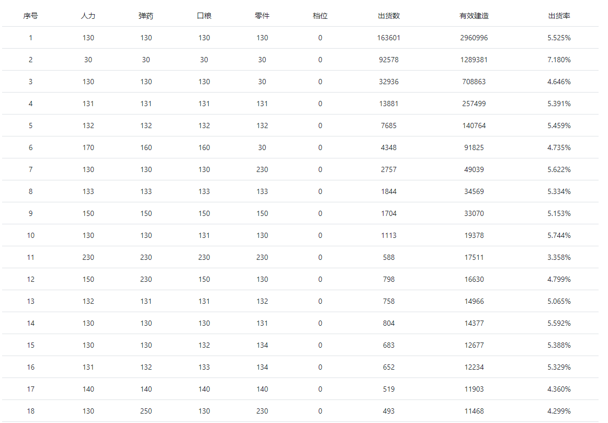

# IOP出货统计 设计文档

## 关于少女前线的建造系统

作为一款Clike手机游戏，少女前线(简称少前)拥有一个较为复杂的人形/装备/妖精建造系统：通过投入4项资源(人力mp、弹药ammo、口粮mre、零件part)，根据各项资源的投入数量，来决定能够出现的人形/装备类型以及概率。

如一些常见的人形建造公式(来自[少女前线wiki]([http://www.gfwiki.org/w/%E4%BA%BA%E5%BD%A2%E5%BB%BA%E9%80%A0](http://www.gfwiki.org/w/人形建造)))

| 人形类型   | 人力 | 弹药 | 口粮 | 零件 |
| ---------- | ---- | ---- | ---- | ---- |
| 人形混合   | 400  | 400  | 400  | 200  |
| HG手枪     | 130  | 130  | 130  | 30   |
| SMG冲锋枪  | 400  | 400  | 100  | 200  |
| RF步枪     | 400  | 100  | 400  | 200  |
| AR突击步枪 | 100  | 400  | 400  | 200  |
| MG机枪     | 800  | 800  | 100  | 400  |

如，投入公式130 130 130 20，**大概率**会得到类型为手枪的一个人形(也有可能出现其它类型，不同类型的公式阈值有重叠)。

同时，还存在着**普通建造**与**重型建造**的区别：两种建造的投入资源上下限不同，且能够产出的人形类型也不完全相同（如普通建造无法产出SG霰弹枪，重型建造无法产出HG手枪）。在此之上，重型建造还分为3档，其出现稀有人形的概率也有所不同。

## 为什么会有IOP建造统计？

网站正式上线于2016年。由于游戏系统的不成熟，还没有加入建造日志功能，没有概率公示，也没有官方推荐公式，因此玩家只能依靠经验来投入资源进行建造。这样不仅对新人入门极不友好，也无法准确的得知各个稀有度的概率，或是定向地建造自己想要的，因此开发了IOP建造统计。

最初，该网站配合另一个项目[GFHelper](https://github.com/Lyt99/GFHelper)，使用游戏代理的方式来上传玩家在游戏中的建造数据。后来，官方退出了建造日志功能，网站改为了通过爬虫来爬取游戏内建造日志的形式获得数据。

目前已经运行4年，单日PV平均在2k-3k，高峰时期日PV能够达到1w+。

## 数据的表示

在游戏内部数据中，使用档位(input_level)来标识普通建造与重型建造(0为普通建造，1、2、3为重型建造的3个档位)。

因此，一个完整的公式可以表示为

```json
{
    "mp": 400,
    "ammo": 400,
    "mre": 400,
    "part": 20,
    "input_level": 0
}
```

代表 **人力 弹药 口粮 零件**四项资源分别为400 400 400 200的**普通建造**。

同时，每个人形/装备/妖精拥有其独立的ID，但不同类型的ID可能出现重复，因此需要加入类型字段进行标识。

```json
{
    "id": 1,
    "type": 0
}
```

其中约定，类型**0代表人形**、**1代表装备**、**2代表妖精**

再添加上时间(10位时间戳)字段，一个数据条目可以表示为

```json
{
    "formula": {
        "mp": 400,
        "ammo": 400,
        "mre": 400,
        "part": 20,
        "input_level": 0
	},
    "id": 1,
    "type": 0,
    "time": 1234567890
}
```

## 网站功能

### 根据人形/装备/妖精查询公式

网站主要功能，在主页点击某一个人形/装备/妖精，即可进入数据查看页面。

页面中显示了该条目对应的公式、公式在该条目的出货数和当前公式的总出货数，并计算概率。



### 根据公式查询对应人形/装备/妖精

通过在人形/装备/妖精查询公式数据查看页面点击某条公式进入。

页面中显示了该条公式对应建造出的人形/装备/妖精，以及它们的建造数目，并计算概率。


## API文档

详见[此处](api.md)

## 功能实现

下面以id、type、formula分别代表ID、类型和公式。

### 第一代(纯查询汇总)

网站初期，数据数量较少，可以直接对**数据表示**一节中的单个数据条目构成的表进行查询。

(id,type)查询formula共分为三步：

	1. 以(id, type)为查询条件，查找不重复的formula
 	2. 遍历查询到的formula，以(id, type, formula)为查询条件，统计得到的记录数。
 	3. 遍历查询到的formula，以formula为查询条件，统计得到的记录数。

formula查询(id, type)共分为两步：

1. 以formula为查询条件，查找不重复的(id, type)
2. 遍历查询到的(id, type)，以(id, type, formula)为查询条件，统计得到的记录数。

之后将统计到的记录返回，概率可以交由前端计算。

当爬虫爬入数据后，无需进行任何多余处理，直接插入数据库即可。

这样做实现十分简单直观，但是当数据量较大的时候，查询时间变得无法接受，所以需要考虑新的数据库结构。

### 第二代(汇总表)

当数据量增长到百万、千万级别的时候，第一代的查询速度已经无法接受了，进行一次查询可能要花费20s的时间。

因此，在第一步的基础上，引入一个汇总表。汇总表记录设计如下：

```json
{
    "formula": {
        "mp": 400,
        "ammo": 400,
        "mre": 400,
        "part": 20,
        "input_level": 0
	},
    "id": 1,
    "type": 0,
    "count": 100
}
```

在单个数据条目的基础上，根据(id, type, formula)提前进行了汇总，count为符合(id, type, formula)条件的条目数量。

(id,type)查询formula共分为两步：

 	1. 以(id, type)为查询条件，查找所有条目
 	2. 遍历查询到的条目，以formula为查询条件，计算所有字段count的和。

第一步获得的条目中的count即为(id, type, formula)的建造数量，第二步得到的和即为formula的总建造数目

formula查询(id, type)只需一步：

1. 以formula为查询条件，查找所有条目

将所有条目中的(id, type, count)返回即可。

经过一步汇总后，在汇总表上的查询速度得到了大幅度提升。

当爬虫爬入数据后，不光需要将条目插入数据库(其实不必要，作为留档)，还需要将本次数量的增量更新到汇总表中。

同时，因为数据数量的增多，(id, type)查询formula的第一步如果不加过滤，可能会产生大量条目，不光会导致第二步的查询次数增加，也会影响返回数据的观感。所以，制定了以下数据过滤规则：

	1. 如果当前已有条目数量小于**最小条目数量阈值**，则加入新读入的条目
 	2. 如果新读入的条目count大于**最小建造数量阈值**，则加入到已有条目中

这样，保证了查询出的结果不会太多，也不会过少。

为了进一步优化响应速度，对每一个页面进行了全页缓存，命中缓存后即可避免访问数据库。当爬虫爬取新数据后需要清空全部缓存。

这样看起来基本已经十分完美了，但是随着使用，又出现了一个新的问题：

游戏中会在大于**数据库中第一条数据收集时间**之后的某个时间点加入新的(id, type)。

此时**新加入的(id, type)在某一formula上的条目数除以formula的总数并不等于该(id, type)在此formula上的概率**，因为formula总数包括了在(id, type, formula)出现前的数量。为了处理这个问题，需要做进一步改进。

### 第三代(后缀和汇总表)

一个比较简单的想法是将第二代中的汇总表加入时间字段，对记录按照时间进行切分。

这样查询的时候可以按照时间段进行查询，不仅解决了第二代中出现的概率问题，也可以支持在可接受时间内对数据库内数据进行任意时间段的查询。

经过考虑后，我们以天为粒度对时间进行划分，**date为形如20200324的日期**。

```json
{
    "formula": {
        "mp": 400,
        "ammo": 400,
        "mre": 400,
        "part": 20,
        "input_level": 0
	},
    "id": 1,
    "type": 0,
    "count": 100,
    "date": 20200324
}
```

我们设一次查询的开始日期为from，结束日期为to

通过(id, type, from, to)查询formula需要：

	1. 查询(id, type)在from到to中所有不重复的formula
 	2. 遍历formula，查询(id, type, formula)在from到to上的所有条目，将count相加
 	3. 遍历formula，查询formula在from到to上的所有条目，将count相加

通过(formula, from, to)查询(id, type)需要：

	1. 查询formula在from到to中所有不重复的(id, type)
 	2. 遍历(id, type)，查询(id, type, formula)在from到to上的所有条目，将count相加

其中，查找不重复元素、相加是很难通过设置索引进行优化的，因此该方法也可能会十分耗时。

因此，提出一种后缀和的方法来解决这个问题。

在后缀和中，(id, type, formula, date)所对应的条目的count不再为当天的建造数量，而是为**date代表日期及之前的所有建造数量**。

如第1天的建造数量为1，第2天的建造数量为5，第3天为10，第4天为0，第5天为2，则date与count的值为

| date  | 1    | 2    | 3    | 4    | 5    |
| ----- | ---- | ---- | ---- | ---- | ---- |
| count | 1    | 6    | 16   | 16   | 18   |

同时规定date小于等于0时，count为0。

因此，from与to之间的数量可以使用 from的count与**to - 1**的count相减得到。

这样的话，进行区间内数量的查询就不需要进行扫描求和操作了，而是可以直接将两条记录的count相减得到。

但实际实现中发现，实现一个完全连续的后缀和会很困难，真实的情况很有可能是

| date  | 1    | 2    | 3    | 4    | 5    |
| ----- | ---- | ---- | ---- | ---- | ---- |
| count | 1    | 6    | 16   | x    | 18   |

x表示该数据不存在于数据库。如果这时求第2-4天的数量或者第5天的数量，就会产生错误，因为date=4并不存在于数据库中。

但如果第4天的记录不存在(即第4天的建造数量为0)，那么**第2-4天的数量等于第2-3天**的数量，**第5天的数量等于第5天减去第3天的数量**。

因此，对于不存在的数据，我们可以通过**求得左边界**的形式来找到该数据的代替。并且通过设置合适的索引，该操作也可以避免扫描。当左边界也未找到时，返回0。

如果想要求得的区间都位于一个连续的空白区域，那么to求得的左边界会小于from，此时直接返回0即可，避免一次多余的查询。

我们再考虑求得不重复formula和(id, type)的问题。按照时间范围查询再求得不重复值还是无法避免对数据的扫描。因此维护了一个formula与(id, type)的对应关系。

```json
{
    "formula": {
        "mp": 400,
        "ammo": 400,
        "mre": 400,
        "part": 20,
        "input_level": 0
	},
    "count": 10,
    "id": [1,2,3],
    "type": 0
}
```

通过这个表来获得不重复的值。同时为了便于数据条数过滤，添加公式总数count。

至此，使用后缀和汇总表的查询流程基本叙述完毕。

当爬虫爬取新数据的时候，需要更新当天的数据，如果当天还未存在(id, type, formula, date)条目，则需要将小于当前天的(id, type, formula)中的count累加上来。之后再更新formula与(id, type)的对应关系表。

同样的使用全页缓存。爬虫爬取新数据后，只需要清理与当天相关的缓存即可。

关于缓存粒度的选择，一开始是对每一个(id, type, formula, date)所得到的count进行了缓存，在测试过程中发现加入缓存后的速度甚至比加入缓存前要慢很多，后来经过排查发现，是因为缓存粒度过细，导致大部分开销集中在了获得缓存上，于是又将其改回全页缓存。


